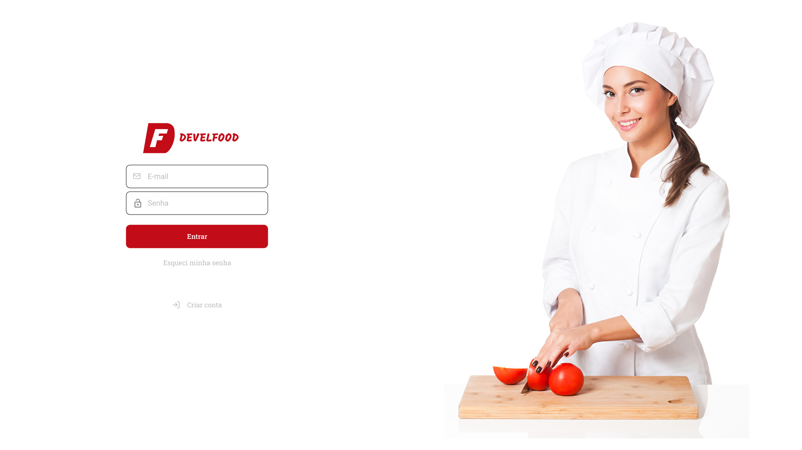
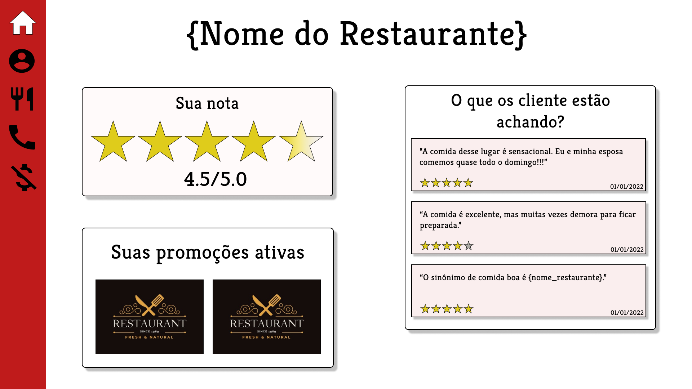
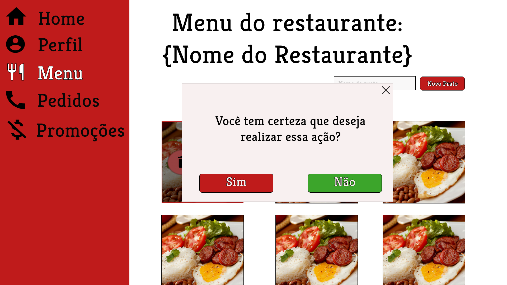

<h1 align="center">
  
</h1>

Um sistema que irá auxiliar as tarefas do dia-a-dia do seu restaurante.

  <a href="#plate_with_cutlery-plataforma">Plataforma</a> •
  <a href="#crab-layout">Layout</a> •
  <a href="#computer-tecnologias">Tecnologias</a> •
  <a href="#chains-licenc-a">Licença</a> 

## :plate_with_cutlery:	Plataforma

A plataforma web da Develfood permite ao usuário: 

  - Gerenciamento do menu do restaurante, havendo a possibilidade da inclusão, exclusão ou edição de pratos.  
  - Controle em tempo real da situação de cada pedido.
  - Inclusão e exclusão de possíveis promoções.
  - Visualização do feedback dos clientes.

## :art: Layout

  
  
  

## :computer: Tecnologias

As ferramentas utilizadas na construção do projeto foram:

- [React](https://pt-br.reactjs.org/)
- [TypeScript](https://www.typescriptlang.org/)
- [Node.js](https://nodejs.org/en/)
- [Eslint](https://eslint.org/)
- [Sass](https://sass-lang.com/)
- [Prettier](https://prettier.io/)

## :chains:	Licença

Este projeto esta sobe a licença MIT.
